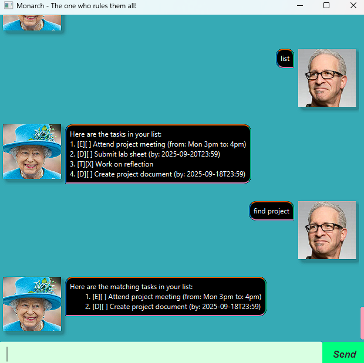

# Monarch User Guide




Welcome to Monarch, a cutting-edge chatbot you never knew you needed! Inspired by the Java mascot _Duke_, it provides 
an interactive application for you to keep track of your tasks! Given below are instructions on how to use it.


## Adding Tasks

### To-Dos
Add a generic task to your task list.

Example:
```
# todo <task description>

todo Research on the Duke
```

Sample output:

```
Got it! I've added this task:
    [T][ ] Research on the Duke
Now you have 4 task in the list.
```

### Deadlines

Add a task with a deadline to your task list.


Example: 
```
# deadline <task description> /by <date in dd/MM/yyyy> <time in HHmm>

deadline Return book from meeting /by 24/12/2025 2359
```

Sample output:

```
Got it! I've added this task:
    [D][ ] Return book from meeting (by: 2025-12-24T23:59)
Now you have 5 task in the list.
```

### Events
Add a task with both a start & end date to your task list.  
Unlike deadlines, events do not require a specific format to be followed.

Example:
```
# event <task description> /from <start time as string> /to <end time as string>

event Attend the roundtable meeting /from Today 2pm /to 1700hrs
```

Sample output:

```
Got it! I've added this task:
    [E][ ] Attend the roundtable meeting (from: Today 2pm to: 1700hrs)
Now you have 6 task in the list.
```


## Delete / Clear

Delete a task from your task list.

Example:
```
# delete <task number>
delete 1
```

Sample output:
```
Noted, I've removed the task:
    [T][ ] Research on the Duke
Now you have 5 tasks in the list.
```
Alternatively, you can also clear your task list completely.

Example:
```
clear
```

Sample output:
```
Noted, I've cleared all tasks
```


## List

Display all tasks in your task list.

Example:
```
list
```

Sample output:
```
Here are the tasks in your list:
1.[T][ ] Research on the Duke
2.[D][ ] Return book from meeting (by: 2025-12-24T23:59)
3.[E][ ] Attend the roundtable meeting (from: Today 2pm to: 1700hrs)
```


## Mark / Unmark

Marks / Unmarks a task as done/undone.

Example:
```
# mark <task number>
# unmark <task number>

mark 2
```

Sample output:
```
Nice! I've marked this task as done:
    [D][X] Return book from meeting (by: 2025-12-24T23:59)
```


## Find

Finds all tasks with descriptions that contain the given keywords.

Example:
```
# find <task description>

find meeting
```

Sample output:
```
Here are the matching tasks in your list:
1. [D][X] Return book from meeting (by: 2025-12-24T23:59)
2. [E][ ] Attend the roundtable meeting (from: Today 2pm to: 1700hrs)
```


## Sort

Sort all tasks in your task list by their type and timings if applicable

Example:
```
sort
```

Sample output:
```
Here are the sorted tasks in your list:
    1. [E][ ] Attend the roundtable meeting (from: Today 2pm to: 1700hrs)
    2. [D][X] Return book from meeting (by: 2025-12-24T23:59)
    3. [T][ ] Research on the Duke
```


## Exit
Saves the current task list and exits the application.

Example:
```
bye
```

Sample output:
```
Bye. Hope to see you again soon!
```